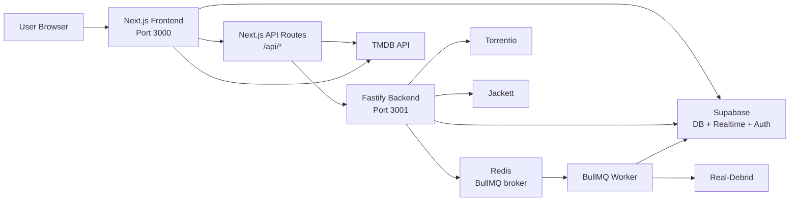
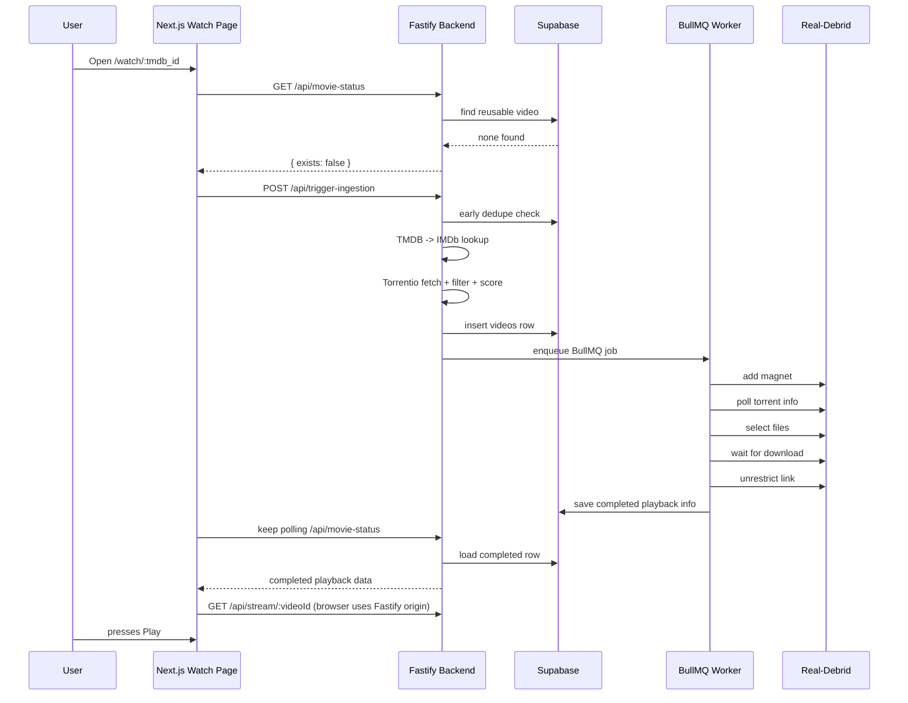
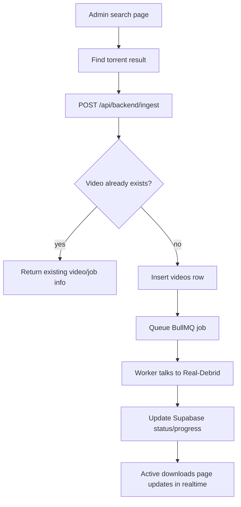
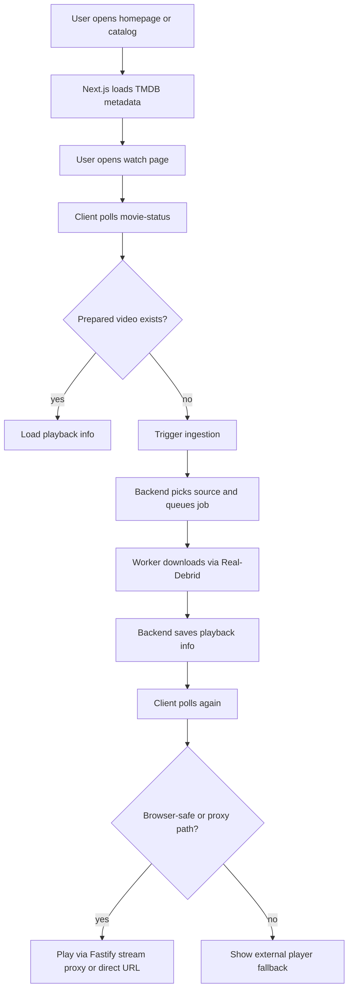

# PoPoTube Codebase Documentation

## 1. What This App Is

PoPoTube is a two-part app:

1. A **Next.js frontend** in the repository root.
2. A **Fastify backend** in `backend/`.

The frontend gives users a movie and TV browsing experience.
The backend does the heavy work:

- finding torrents
- sending torrents to Real-Debrid
- waiting for Real-Debrid to finish
- saving playback info in Supabase
- serving browser-friendly streams

In very plain words:

- **TMDB** gives PoPoTube movie and TV metadata.
- **Torrentio** and **Jackett** help PoPoTube find torrent sources.
- **Real-Debrid** downloads and exposes the media as HTTP links.
- **Redis + BullMQ** run background ingestion jobs.
- **Supabase** stores app data and admin auth state.
- **External player** is the supported path for containers and codecs the browser cannot decode; Fastify `GET /api/stream/:videoId` proxies Real-Debrid bytes when the UI still attempts in-browser playback.

Important note:
Older repo notes say the public watch flow checks Real-Debrid instant availability before queueing. The **current code in `backend/src/routes/trigger-ingestion.ts` does not do that**. Right now it:

1. resolves TMDB to IMDb
2. fetches Torrentio candidates
3. filters and scores them
4. inserts a `videos` row
5. enqueues a BullMQ job
6. lets the worker do the Real-Debrid work

So the code is more honest than the old docs. Bless it.

---

## 2. Repository Layout

```text
/
├── app/                     Next.js App Router pages and API routes
├── components/              UI and page-level client components
├── hooks/                   Watch and TV ingestion hooks
├── lib/                     Frontend helpers and data adapters
├── utils/                   Supabase auth/client helpers
├── backend/
│   ├── src/
│   │   ├── index.ts         Fastify bootstrap
│   │   ├── routes/          Backend API routes
│   │   ├── queue/           BullMQ queue + worker
│   │   └── lib/             Backend service adapters/helpers
│   ├── scripts/             One-off maintenance scripts
│   └── Dockerfile
├── supabase/migrations/     SQL migrations tracked in repo
├── docs/                    Design/product notes and screenshots
├── docker-compose.dev.yml   Local backend + Jackett stack
└── backend/docker-compose.vps.yml
                            VPS backend stack
```

---

## 3. High-Level Architecture



### Main idea

- The **frontend** is the user-facing app.
- The **frontend API routes** act like a light proxy/BFF layer.
- The **backend** owns ingestion, queueing, stream state, and external media service communication.
- The **worker** is where the actual Real-Debrid pipeline runs.

---

## 4. Services and Their Jobs

| Service          | Where it runs          | What it does                                                 |
| ---------------- | ---------------------- | ------------------------------------------------------------ |
| Next.js frontend | root project           | UI, page rendering, frontend API proxying                    |
| Fastify backend  | `backend/`             | ingestion API, queue control, stream proxy, settings, search |
| Redis            | external/local         | BullMQ queue broker                                          |
| BullMQ worker    | inside backend process | processes ingestion jobs                                     |
| Supabase         | external               | stores `videos`, `app_settings`, auth, realtime updates      |
| TMDB             | external               | metadata for homepage, search, discover, watch pages         |
| Torrentio        | external               | public watch source discovery                                |
| Jackett          | external/local Docker  | admin search source discovery                                |
| Real-Debrid      | external               | magnet handling, torrent download, unrestricted HTTP links   |

---

## 5. Runtime and Environment Model

### Local development

- Frontend runs on `http://localhost:3000`
- Backend runs on `http://127.0.0.1:3001`
- Jackett usually runs on `http://127.0.0.1:9117`
- Redis usually runs on `redis://127.0.0.1:6379`

### Compose behavior

`docker-compose.dev.yml` runs:

- `jackett`
- `backend`

It does **not** run the Next.js frontend.

### Important environment files

- Root frontend template: `.env.frontend.example`
- Root shared/local template: `.env.example`
- Backend template: `backend/.env.example`

### Important variables

| Variable                                       | Used by            | Meaning                              |
| ---------------------------------------------- | ------------------ | ------------------------------------ |
| `BACKEND_URL`                                  | Next.js            | backend base URL for proxy/API calls |
| `TMDB_API_KEY`                                 | frontend + backend | TMDB access                          |
| `TMDB_BASE_URL`                                | frontend + backend | TMDB base URL                        |
| `NEXT_PUBLIC_SUPABASE_URL`                     | frontend           | public Supabase project URL          |
| `NEXT_PUBLIC_SUPABASE_PUBLISHABLE_DEFAULT_KEY` | frontend           | public Supabase key                  |
| `SUPABASE_URL`                                 | backend            | Supabase URL for service client      |
| `SUPABASE_SERVICE_ROLE_KEY`                    | backend            | privileged backend key               |
| `REDIS_URL`                                    | backend            | BullMQ/Redis connection              |
| `REAL_DEBRID_API_KEY`                          | backend            | fallback Real-Debrid key             |
| `JACKETT_URL`                                  | backend            | Jackett base URL                     |
| `JACKETT_API_KEY`                              | backend            | Jackett API key                      |

### Backend env loading order

`backend/src/lib/env.ts` loads env files in this order:

1. `process.cwd()/.env`
2. `backend/.env`
3. repo root `.env`
4. default dotenv behavior

This is why the backend can work with a root `.env` or a backend symlinked `.env`.

---

## 6. Frontend Route Map

These are the main user-facing pages in the current code.

| Route                            | Purpose                                  | Data source                                       |
| -------------------------------- | ---------------------------------------- | ------------------------------------------------- |
| `/`                              | homepage with featured/trending/arrivals | TMDB server-side fetches                          |
| `/movies`                        | movie catalog                            | TMDB discover                                     |
| `/tv-series`                     | TV catalog                               | TMDB discover                                     |
| `/categories`                    | static genre list                        | hardcoded genre definitions                       |
| `/categories/[genre]`            | genre results page                       | `/api/tmdb/discover`                              |
| `/search`                        | movie/TV search page                     | `/api/tmdb/search`                                |
| `/browse/[slug]`                 | provider-specific browse page            | TMDB provider catalog                             |
| `/watch/[tmdb_id]`               | public movie watch page                  | TMDB details + PoPoTube ingestion flow            |
| `/watch/tv/[tmdb_id]`            | public TV series watch page              | TMDB TV details + episode ingestion flow          |
| `/admin/login`                   | admin sign-in                            | Supabase auth                                     |
| `/admin`                         | admin dashboard                          | `/api/backend/dashboard/stats`                    |
| `/admin/activedownloads`         | active job view                          | Supabase direct query + realtime                  |
| `/admin/torrents`                | Real-Debrid torrent library              | `/api/backend/library`                            |
| `/admin/downloaded-unrestricted` | unrestricted download links              | `/api/backend/downloads`                          |
| `/admin/search-jackett`          | manual Jackett search + ingest           | `/api/search` and `/api/backend/ingest`           |
| `/admin/search-torrentio`        | manual Torrentio search + ingest         | `/api/torrentio/search` and `/api/backend/ingest` |
| `/admin/settings`                | Real-Debrid account view                 | `/api/backend/settings/real-debrid/user`          |
| `/admin/settings/integrations`   | save API keys                            | `/api/backend/settings/configs*`                  |
| `/admin/settings/queue`          | placeholder queue settings page          | static UI                                         |
| `/admin/settings/utilities`      | placeholder maintenance page             | static UI                                         |

### Admin protection

Admin routes are protected in `utils/supabase/middleware.ts`.

- If the user is not logged in and visits `/admin/*`, they are redirected to `/admin/login`.
- If the user is already logged in and visits `/admin/login`, they are redirected to `/admin`.

The root `proxy.ts` wires this middleware-like behavior into Next.js request handling.

---

## 7. Frontend API Route Inventory

These live in `app/api/**`.

### 7.1 TMDB routes

| Method | Route                 | Purpose                                     |
| ------ | --------------------- | ------------------------------------------- |
| `GET`  | `/api/tmdb/trending`  | TMDB trending movies                        |
| `GET`  | `/api/tmdb/search`    | TMDB multi-search filtered to movies/TV     |
| `GET`  | `/api/tmdb/discover`  | TMDB discover for movie or TV, with filters |
| `GET`  | `/api/tmdb/tv/season` | TMDB season details                         |

### 7.2 Public watch proxy routes

_(Historical: these Next.js routes were removed; the browser calls Fastify directly.)_

| Method | Route                           | Purpose                                       |
| ------ | ------------------------------- | --------------------------------------------- |
| `GET`  | `/api/public/movie-status`      | (removed) was a proxy to backend movie status |
| `POST` | `/api/public/trigger-ingestion` | (removed) was a proxy to backend trigger      |

### 7.3 Search and backend pass-through routes

| Method                      | Route                    | Purpose                                       |
| --------------------------- | ------------------------ | --------------------------------------------- |
| `GET`                       | `/api/search`            | frontend proxy to backend Jackett search      |
| `GET/POST/PUT/DELETE/PATCH` | `/api/backend/[...path]` | generic pass-through to backend `/api/*`      |
| `GET`                       | `/api/torrentio/search`  | frontend-side Torrentio lookup for admin page |

### 7.4 Rewrites

`next.config.ts` rewrites:

```text
/api/proxy/:path*  ->  {BACKEND_URL}/api/:path*
```

This is mainly used for stream proxying, such as:

```text
/api/proxy/stream/:videoId  ->  backend /api/stream/:videoId
```

---

## 8. Backend API Inventory

These live in `backend/src/routes`.

### 8.1 Health and queue UI

| Method | Route           | Purpose             |
| ------ | --------------- | ------------------- |
| `GET`  | `/health`       | simple health check |
| `GET`  | `/admin/queues` | Bull Board queue UI |

### 8.2 Ingestion and watch routes

| Method | Route                    | Purpose                                                                    |
| ------ | ------------------------ | -------------------------------------------------------------------------- |
| `POST` | `/api/ingest`            | admin/manual ingest from a magnet                                          |
| `POST` | `/api/trigger-ingestion` | public watch ingestion pipeline                                            |
| `GET`  | `/api/movie-status`      | returns reusable video status for TMDB movie or TV episode                 |
| `GET`  | `/api/stream/:videoId`   | proxy stream bytes from saved playback URL                                 |
| `POST` | `/api/cancel-job`        | deletes a video row so active UI job disappears and worker stops naturally |

### 8.3 Admin/utility routes

| Method   | Route                            | Purpose                                           |
| -------- | -------------------------------- | ------------------------------------------------- |
| `GET`    | `/api/dashboard/stats`           | dashboard summary                                 |
| `GET`    | `/api/search`                    | Jackett search                                    |
| `GET`    | `/api/library`                   | Real-Debrid torrent list                          |
| `DELETE` | `/api/library/:id`               | delete torrent from Real-Debrid                   |
| `GET`    | `/api/library/:id/stream`        | unrestrict one torrent link and return stream URL |
| `GET`    | `/api/downloads`                 | Real-Debrid download link list                    |
| `DELETE` | `/api/downloads/:id`             | delete a Real-Debrid download link                |
| `GET`    | `/api/settings/real-debrid/user` | Real-Debrid account profile                       |
| `GET`    | `/api/settings/configs/:key`     | read app setting from Supabase                    |
| `POST`   | `/api/settings/configs`          | upsert app setting into Supabase                  |

---

## 9. Data Model Used by the App

The app mostly revolves around two database tables that the code clearly uses.

### 9.1 `videos`

This is the main working table for ingestion and playback.

Important columns used by the code:

| Column                     | Meaning                                                   |
| -------------------------- | --------------------------------------------------------- |
| `id`                       | primary video/job id used everywhere                      |
| `title`                    | human-readable title                                      |
| `info_hash`                | magnet hash used for dedupe                               |
| `magnet_uri`               | magnet link                                               |
| `size_bytes`               | selected torrent size                                     |
| `tmdb_id`                  | TMDB movie or TV series id                                |
| `tmdb_media_type`          | `movie` or `tv`                                           |
| `tmdb_episode_id`          | optional episode id when used in future                   |
| `season_number`            | TV season number                                          |
| `episode_number`           | TV episode number                                         |
| `release_year`             | parsed from release name                                  |
| `release_group`            | parsed release group                                      |
| `release_parse_extras`     | parsed metadata extras JSON                               |
| `status`                   | lifecycle state like pending/downloading/completed/failed |
| `progress`                 | numeric progress                                          |
| `error_message`            | failure or retry text                                     |
| `bullmq_job_id`            | queue job id                                              |
| `stream_url`               | direct unrestricted Real-Debrid URL                       |
| `playback_source`          | saved canonical playback source JSON                      |
| `created_at`, `updated_at` | timestamps                                                |

### 9.2 `app_settings`

This stores key/value app configuration.

Current confirmed use:

- `REAL_DEBRID_API_KEY`

The backend reads this first before falling back to `process.env.REAL_DEBRID_API_KEY`.

### 9.3 Supabase Auth

Supabase Auth is used for admin login.

- `app/admin/login/actions.ts` uses `signInWithPassword`
- request protection is enforced by Supabase session middleware logic

### 9.4 Realtime

`/admin/activedownloads` subscribes directly to Supabase realtime for the `videos` table.

That page updates on:

- insert
- update
- delete

So the active download list moves in real time without asking the backend over and over like a needy goblin.

---

## 10. Main Working Principles

## 10.1 Browse flow

For browse pages, the app is simple:

1. Next.js page or API route fetches data from TMDB.
2. The page renders posters, titles, and metadata.
3. Clicking a title goes to a watch page or a browse page.

This part is metadata-only.
No Real-Debrid work happens yet.

## 10.2 Public movie watch flow

When a user opens `/watch/[tmdb_id]`, the watch page:

1. fetches TMDB movie details on the server
2. renders the movie experience shell
3. starts the `useWatchIngestion` hook on the client
4. polls `/api/public/movie-status`
5. if no prepared video exists, posts to `/api/public/trigger-ingestion`
6. keeps polling until the backend says the file is completed or failed
7. opens `WatchNetflixPlayer` when playback becomes available

### Public movie watch sequence



## 10.3 Public TV episode watch flow

The TV flow is almost the same, but with episode targeting.

The page:

1. loads TV details and one season from TMDB
2. lets the user choose a season and episode
3. starts `useTvEpisodeIngestion(tvId, season, episode, ...)`
4. polls `/api/public/movie-status?tmdb_id=...&season=...&episode=...`
5. if nothing exists, posts to `/api/public/trigger-ingestion` with:
   - `media_type: "tv"`
   - `season_number`
   - `episode_number`
6. the backend then finds or creates the correct `videos` row for that specific episode

The worker itself does not care whether it is movie or TV.
That distinction mostly matters when:

- finding reusable existing rows
- saving `tmdb_media_type`
- setting `season_number` and `episode_number`

## 10.4 Manual admin ingest flow

Admins have two ways to manually ingest:

1. **Jackett search page**
2. **Torrentio search page**

In both cases, the admin:

1. searches for a title
2. chooses a result
3. sends the magnet to `/api/backend/ingest`
4. backend creates or reuses a `videos` row
5. backend queues BullMQ job
6. active progress appears in `/admin/activedownloads`

### Admin manual ingest flow



## 10.5 Playback decision logic

Playback is decided from `lib/watch-playback.ts`.

### Rule set

1. If `playback_source.type === "direct"` and the row has an `id`, use Fastify `GET /api/stream/:id` (Real-Debrid byte proxy).
2. Else fall back to `playback_source.url` or `stream_url`.

### Browser compatibility logic

- Browser-safe containers are treated as:
  - `mp4`
  - `webm`
- Non-browser-safe containers like `mkv` typically need an external player; the UI may still attempt `/api/stream/:id` depending on codec support.

## 10.6 Active job tracking

Status is stored in `videos.status`.

Statuses clearly used by code:

- `pending`
- `submitted`
- `downloading_torrent`
- `exposing_http`
- `completed`
- `retrying`
- `failed`

Progress is stored in `videos.progress`.

The worker maps Real-Debrid download progress into app progress:

- Real-Debrid `0% -> 100%`
- app stores roughly `0 -> 50` during cloud download
- app moves to `50` when exposing HTTP
- app becomes `100` when completed playback info is saved

---

## 11. Detailed Backend Pipeline

## 11.1 `POST /api/trigger-ingestion`

This is the public watch pipeline.

### What it does

1. validates request body
2. decides whether request is for a movie or TV episode
3. checks Supabase for a reusable existing video row
4. resolves IMDb id from TMDB
5. checks again for race-condition reuse
6. fetches Torrentio candidates
7. filters out bad candidates
8. scores remaining candidates
9. picks the best result
10. inserts or reuses a `videos` row
11. enqueues BullMQ job
12. stores BullMQ job id in Supabase

### Torrentio filters

Current filters remove candidates when:

- no magnet or hash
- below 1080p
- MPEG-TS container (`.ts`) style release

### Torrent scoring factors

Current score logic favors:

- title match
- year match
- 1080p / 1080i
- WEB-DL and Blu-Ray
- efficient codecs like HEVC/AV1
- healthy seeder count

Current score logic penalizes:

- title mismatch
- missing year
- below 1080p
- CAM/TS/telecine garbage
- sample releases
- very tiny files
- very huge files
- no seeders
- `.ts` container releases

## 11.2 `POST /api/ingest`

This is the manual/admin ingest route.

It is simpler than public trigger-ingestion because the magnet is already chosen.

### What it does

1. validates `magnet`, `size`, `title`
2. parses release metadata from the title
3. detects whether content is movie or TV from parsed season/episode
4. checks for reusable TMDB-linked video row when `tmdb_id` is provided
5. extracts `info_hash`
6. inserts the `videos` row
7. handles duplicate `info_hash`
8. queues the job
9. saves BullMQ job id

## 11.3 BullMQ worker

The worker lives in `backend/src/queue/ingestion.ts`.

### Worker steps

| Step             | What happens                                       |
| ---------------- | -------------------------------------------------- |
| load row         | reads `videos` row from Supabase                   |
| mark downloading | updates status to `downloading_torrent`            |
| add magnet       | calls Real-Debrid `addMagnet`                      |
| wait conversion  | polls Real-Debrid until file selection is possible |
| select files     | uses Real-Debrid file scoring/selection            |
| wait download    | polls until RD says torrent is downloaded          |
| expose HTTP      | status becomes `exposing_http`                     |
| refresh links    | gets final Real-Debrid links                       |
| unrestrict link  | gets unrestricted direct HTTP download URL         |
| decide playback  | save Real-Debrid `playback_source` + `stream_url`  |
| complete row     | saves playback info and marks row `completed`      |

### Worker failure behavior

If a job fails:

- it logs the error
- BullMQ retries up to 3 attempts with exponential backoff
- Supabase row becomes:
  - `retrying` if more attempts remain
  - `failed` if attempts are exhausted

### Worker concurrency

Current worker concurrency is:

```text
5
```

This is set directly in the worker options.

---

## 12. How the Backend Talks to Other Services

## 12.1 Supabase

Backend usage:

- stores and reads `videos`
- stores and reads `app_settings`
- supports dedupe, status polling, and playback lookup

Frontend usage:

- Supabase Auth for admin login/session
- Supabase Realtime on `/admin/activedownloads`

Important code paths:

- backend client: `backend/src/lib/supabase.ts`
- frontend browser auth client: `utils/supabase/client.ts`
- frontend server auth client: `utils/supabase/server.ts`
- session refresh/protection: `utils/supabase/middleware.ts`

## 12.2 Redis + BullMQ

The backend imports the queue on startup:

- `backend/src/index.ts` imports `./queue/ingestion`

That means:

- queue is created immediately
- worker is created immediately
- backend process owns the queue and worker together

Redis is required.
If `REDIS_URL` is missing, backend startup throws.

## 12.3 Real-Debrid

The backend uses `backend/src/lib/real-debrid.ts`.

### Important Real-Debrid methods used

| Method                                 | Use                             |
| -------------------------------------- | ------------------------------- |
| `getUser()`                            | account info                    |
| `getTorrents()`                        | list torrent library            |
| `getTorrentInfo(id)`                   | poll torrent state              |
| `addMagnet(magnet)`                    | add torrent                     |
| `selectFiles(id, info, expectedTitle)` | choose best playable files      |
| `unrestrictLink(link)`                 | convert to direct HTTP download |
| `getDownloads()`                       | list unrestricted downloads     |
| `deleteTorrent(id)`                    | remove torrent                  |
| `deleteDownload(id)`                   | remove unrestricted link        |

### Real-Debrid auth behavior

The client tries to load the API key in this order:

1. `app_settings.REAL_DEBRID_API_KEY` from Supabase
2. `process.env.REAL_DEBRID_API_KEY`

It caches the DB-loaded key for 60 seconds.

## 12.4 Torrentio

Used in:

- `backend/src/routes/trigger-ingestion.ts`
- `app/api/torrentio/search/route.ts`

Public watch flow uses Torrentio on the backend.
Admin Torrentio page uses a frontend API route.

## 12.5 Jackett

Used only by backend route:

- `GET /api/search`

The frontend admin page calls `/api/search`, which proxies to backend `/api/search`, which then calls Jackett.

## 12.6 TMDB

TMDB is used by both frontend and backend.

### Frontend usage

- homepage
- browse pages
- discover/search pages
- watch page details
- TV season loading

### Backend usage

- resolving TMDB movie or TV show to IMDb before Torrentio search

## 12.7 Transcoding

PoPoTube does not run an in-repo transcoder. Browser playback uses direct/streamable files and Fastify stream proxying; other containers use external players.

---

## 13. Stream Delivery Model

PoPoTube does not store media on its own disk.

That is a core working principle.

### What really happens

1. Real-Debrid downloads the torrent in Real-Debrid's environment.
2. PoPoTube asks Real-Debrid for unrestricted HTTP access.
3. PoPoTube stores the unrestricted link in the `videos` row.
4. The frontend plays media via Fastify `GET /api/stream/:videoId` when `playback_source` is `direct` (and similarly can use signed URLs from `playback_source` when needed).

### Why the stream proxy exists

For direct sources, the browser calls backend `/api/stream/:videoId` (using `NEXT_PUBLIC_BACKEND_URL` in the client).

That backend route:

1. loads the saved `playback_source` from Supabase
2. finds the URL
3. proxies the response with `reply.from(...)`
4. removes `content-disposition`

This helps the browser play inline rather than treating the media as a download attachment.

---

## 14. Dedupe and Reuse Rules

The app tries very hard not to create duplicate work.

### Reuse by TMDB identity

`findBestVideoForTmdb()` looks up candidate rows and picks the best reusable one.

For movies, reuse is based on:

- `tmdb_id`
- `tmdb_media_type = 'movie'`
- no season/episode

For TV episodes, reuse is based on:

- `tmdb_id`
- `tmdb_media_type = 'tv'`
- `season_number`
- `episode_number`

### Reuse by status

Reusable statuses are:

- `completed`
- `exposing_http`
- `downloading_torrent`
- `pending`
- `submitted`
- `retrying`

### Dedupe by `info_hash`

If insert hits a duplicate hash:

- existing row is loaded
- failed/retrying rows can be reset and reused
- existing good rows are returned instead of creating a new queue job

This is one of the few places in life where duplicate handling is less messy than the average family WhatsApp group.

---

## 15. Logging and Observability

Logging uses `pino` plus `pino-pretty`.

The backend logger is opinionated:

- service badges
- readable labels
- step timing
- safe error serialization
- avoids logging sensitive auth headers

The backend also:

- logs non-success HTTP responses in an `onResponse` hook
- exposes Bull Board at `/admin/queues`

Notable observability features:

- step timers in the worker
- per-watch `watch_flow_id` correlation
- structured Real-Debrid latency logging
- explicit warnings for slow steps

---

## 16. Current Public User Flow



---

## 17. Current Admin Flow

### Dashboard

- fetches queue counts
- fetches recent jobs
- fetches Real-Debrid user
- fetches Real-Debrid torrent count

### Active downloads

- reads `videos` directly from Supabase
- excludes `completed` and `failed`
- subscribes to realtime changes
- can cancel a job through `/api/backend/cancel-job`

### Search pages

- Jackett search is backend-driven
- Torrentio search is Next.js API-driven
- both can send selected magnets to `/api/backend/ingest`

### Torrents page

- lists Real-Debrid torrents
- can delete torrent containers
- has duplicate cleanup helpers based on hash

### Unrestricted downloads page

- lists Real-Debrid unrestricted links
- can delete them
- has duplicate cleanup helpers based on filename + filesize

### Settings

- account page reads Real-Debrid profile
- integrations page stores API key in `app_settings`
- queue/utilities pages are placeholders

---

## 18. Known Gaps and Limitations in the Current Code

These are real, code-based observations.

### 18.1 No automated test suite

- frontend has linting
- backend has TypeScript build/type-check
- there is no real automated test coverage

### 18.2 Queue and utilities settings pages are placeholders

The UI exists, but the backend behavior is not implemented.

### 18.3 Public flow does not currently do Real-Debrid instant-availability selection

Some older docs imply that it does.
The current code does not.

### 18.4 Active downloads page bypasses backend

`/admin/activedownloads` talks directly to Supabase from the browser.

That is not wrong, but it means:

- the page depends on public Supabase client access
- some business logic is split between frontend and backend

### 18.5 Older and newer watch components coexist

`components/public/WatchClient.tsx` still exists, but the main current movie watch path uses:

- `WatchPageShell`
- `WatchMovieExperience`
- `WatchNetflixPlayer`

So the codebase contains some older flow leftovers.

### 18.6 Some browse/search pages are still simpler than the newer watch experience

There is a mix of older straightforward pages and newer more polished experiences.

### 18.7 Non-browser-safe formats may end in external-player fallback

If the container or codec is not reliably playable in the browser, the user may need VLC, IINA, or another external player.

### 18.8 The backend process hosts both API and worker

That is fine for smaller deployments, but not ideal for large-scale isolation.

---

## 19. Future Improvements

These are sensible next steps based on the current implementation.

### 19.1 Add real automated tests

Best targets:

- `trigger-ingestion` scoring and filter logic
- `video-reuse` selection rules
- worker success/failure transitions
- playback URL selection logic
- route validation and error paths

### 19.2 Split API and worker into separate deployable processes

Benefits:

- safer scaling
- cleaner resource control
- worker crashes would not affect API uptime as much

### 19.3 Reintroduce or implement Real-Debrid instant-availability-aware source picking

This would let public watch choose candidates with a better chance of faster startup.

### 19.4 Move more admin data access behind backend APIs

Especially:

- active downloads list
- possibly some settings reads/writes

This would centralize business logic.

### 19.5 Add stronger schema validation

Examples:

- request body validation on backend routes
- response shape validation for external APIs
- environment validation at startup

### 19.6 Add explicit database schema docs and migrations for all used base columns

The repo tracks some migrations, but not the entire original schema creation story.

### 19.7 Add better playback compatibility strategy

Possible improvements:

- clearer guidance when multichannel audio breaks in-browser playback
- subtitle pipeline
- alternate stream fallback order
- richer external-player support

### 19.8 Add richer queue controls

Useful admin actions:

- pause queue
- resume queue
- retry failed jobs
- flush old jobs
- tune concurrency from UI

### 19.9 Add tracing or request correlation across frontend and backend

`watch_flow_id` already exists.
That can be expanded into a stronger end-to-end trace story.

### 19.10 Clean up older components and stale docs

This repo has a few places where the code and older docs disagree.
Cleaning that up would reduce confusion and save future brain cells.

---

## 20. File-by-File Reading Guide

If someone wants to understand the app quickly, read files in this order:

### Frontend

1. `app/(public)/watch/[tmdb_id]/page.tsx`
2. `components/public/watch/WatchPageShell.tsx`
3. `hooks/useWatchIngestion.ts`
4. `lib/watch-playback.ts`
5. `app/(public)/watch/tv/[tmdb_id]/page.tsx`
6. `components/public/watch/WatchTvSeriesExperience.tsx`
7. `hooks/useTvEpisodeIngestion.ts`
8. `app/api/public/*`
9. `app/api/backend/[...path]/route.ts`
10. `utils/supabase/middleware.ts`

### Backend

1. `backend/src/index.ts`
2. `backend/src/routes/trigger-ingestion.ts`
3. `backend/src/routes/ingest.ts`
4. `backend/src/queue/ingestion.ts`
5. `backend/src/lib/real-debrid.ts`
6. `backend/src/lib/playback-source.ts`
7. `backend/src/lib/video-reuse.ts`
8. `backend/src/lib/release-metadata.ts`
9. `backend/src/routes/movie-status.ts`
10. `backend/src/routes/stream.ts`

### Database and operations

1. `supabase/migrations/*.sql`
2. `backend/scripts/backfill-release-metadata.ts`
3. `docker-compose.dev.yml`
4. `backend/docker-compose.vps.yml`

---

## 21. Final Summary

PoPoTube is a metadata-driven streaming app with a queue-backed ingestion pipeline.

The frontend is responsible for:

- showing catalog pages
- starting watch flows
- polling for status
- opening the player

The backend is responsible for:

- picking sources
- deduping work
- queueing jobs
- talking to Real-Debrid
- saving playback data
- proxying streams

The most important tables and ideas are:

- `videos` for everything related to ingestion and playback
- `app_settings` for runtime config
- BullMQ for background jobs
- Real-Debrid for cloud downloading
- Fastify stream proxy for Real-Debrid-backed playback when the UI uses `/api/stream/:id`

If you want to understand the app in one sentence:

**PoPoTube turns TMDB metadata into playable streams by finding torrent sources, downloading them through Real-Debrid in the background, saving playback info in Supabase, and serving bytes through Fastify’s stream proxy or an external player when the browser cannot decode the file.**
