# PoPoTube Playback Architecture: Jellyfin + Zurg + rclone

This document defines the target playback architecture for PoPoTube. It keeps the existing discovery and ingestion brain intact, replaces the current Real-Debrid byte-proxy playback path with Jellyfin as the required playback engine, and uses `Zurg -> WebDAV -> rclone mount` so Jellyfin can treat Real-Debrid-backed media like a filesystem-backed library.

## Executive Summary

PoPoTube already has the hard part of title discovery and ingestion mostly figured out. The app can search TMDB, pick a Torrentio result, orchestrate ingestion through Fastify and BullMQ, and persist ingest state in Supabase. The weak link is the playback layer, which currently relies on Fastify `GET /api/stream/:videoId` to proxy bytes from a stored Real-Debrid URL.

That current playback path is useful, but it is also a bit of a cardboard sword. It forwards bytes, but it does not solve browser compatibility, transcoding, subtitle delivery, bitrate adaptation, or stable playback session handling. If the upstream file is an awkward container or codec combination, the proxy just delivers the pain more efficiently.

The target architecture keeps PoPoTube as the orchestration and metadata layer while moving playback responsibility to Jellyfin:

- PoPoTube remains responsible for title discovery, ingest decisions, job orchestration, and media identity.
- Real-Debrid remains the acquisition backend.
- Zurg exposes the Real-Debrid library through WebDAV.
- rclone mounts that WebDAV share onto a stable filesystem path.
- Jellyfin scans the mounted path, creates a proper media item, and serves playback through HLS, direct play, or transcode sessions.
- Fastify becomes the playback bootstrap layer that resolves a PoPoTube `videoId` into a Jellyfin-backed playback descriptor.

This gives PoPoTube a real playback engine instead of a glorified hose.

## Current State

PoPoTube is currently split into two main packages:

- Frontend: Next.js 16 App Router at the repo root, typically on port `3000`
- Backend: Fastify 5 in `/backend`, typically on port `3001`

Current runtime shape:

- The browser talks to Fastify for public and admin JSON flows.
- Fastify owns ingestion orchestration and the BullMQ queue worker.
- Supabase stores media records, status, and playback metadata.
- TMDB provides title metadata.
- Torrentio and Jackett contribute discovery and search results.
- Real-Debrid provides the acquired media source.
- The current playback path uses `videos.stream_url` and `videos.playback_source`, with Fastify `GET /api/stream/:videoId` forwarding bytes from the stored upstream URL.

Current repo facts this architecture must respect:

- Fastify registers `trigger-ingestion`, `movie-status`, `library`, `stream`, `search`, `torrentio-search`, `tmdb-proxy`, and other routes in `backend/src/index.ts`.
- Frontend playback helpers in `lib/watch-playback.ts` still prefer Fastify `/api/stream/:id` when a stored playback URL exists.
- The worker in `backend/src/queue/ingestion.ts` still treats Real-Debrid as the ingest/acquisition engine.
- Local development today runs Next.js on host, while `docker-compose.dev.yml` only runs `jackett` and `backend`.

### Current-State Architecture Diagram

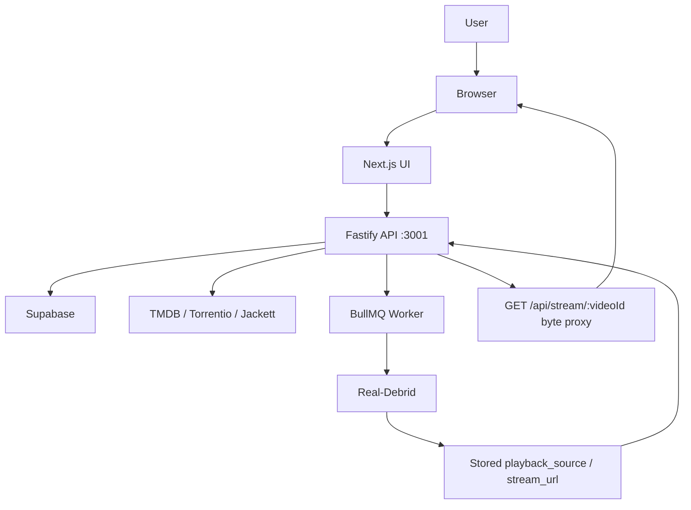

The important limitation is at the end of the line. The browser does not get a playback session from a media engine. It gets a proxied upstream file URL and hopes the browser can decode whatever shows up.

## Target Architecture

The target architecture keeps the ingest brain and replaces the playback muscle.

Target responsibilities:

- Next.js
  - UI, routing, SSR composition, player rendering
  - No direct playback orchestration logic beyond calling Fastify
- Fastify
  - Public and admin orchestration API
  - Ingestion trigger, status lookup, playback bootstrap, Jellyfin integration
  - Ownership of mapping `videoId -> Jellyfin item/media source`
- Supabase
  - Source of truth for PoPoTube media identity, ingest lifecycle, linkage metadata, and status
- Real-Debrid
  - Acquisition and source library
- Zurg
  - WebDAV bridge exposing RD-backed media as a browsable virtual filesystem
- rclone
  - Mounting the WebDAV share at a stable filesystem path visible to Jellyfin
- Jellyfin
  - Library indexing, direct play, HLS delivery, transcoding, subtitle handling, playback session management

The primary playback path becomes:

1. Browser requests playback bootstrap from Fastify for a PoPoTube `videoId`.
2. Fastify resolves stored Jellyfin linkage for that media row.
3. Fastify validates the linkage and requests playback info from Jellyfin.
4. Browser receives a Jellyfin-backed HLS or direct-play descriptor.
5. Browser plays through Jellyfin, not through the old Fastify byte proxy.

### Target Architecture Diagram

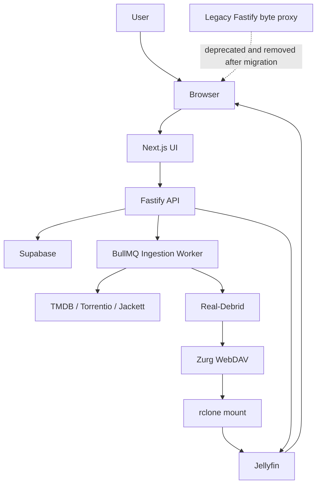

This is the key design line in the sand:

- PoPoTube still decides what media should exist.
- Jellyfin decides how that media should be played.

## User Flow

This section describes what the user does and sees. It is intentionally separate from infra flow, because mixing human actions with backend machinery is how architecture docs become cursed.

### Happy Path: Watch a Title

User-facing behavior:

1. User opens browse or search.
2. User selects a title.
3. PoPoTube checks whether the title already has a completed ingest and valid Jellyfin linkage.
4. If yes, the player starts through Jellyfin-backed playback.
5. If no, PoPoTube starts or resumes ingestion and shows progress until playback becomes ready.

### User Flow Diagram: Happy Path

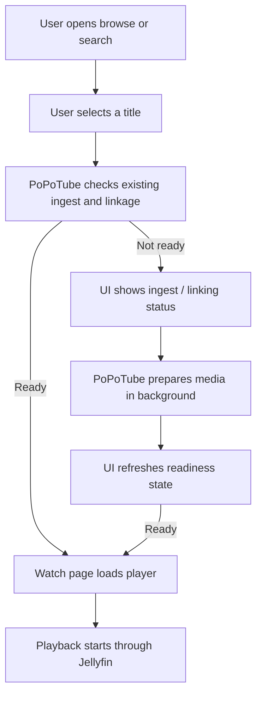

### Unavailable / Delayed Path

User-facing failure or delay cases:

- No usable torrent result is found
- Ingest fails in the RD pipeline
- Zurg/rclone/Jellyfin linkage is delayed
- The title exists in Supabase but is not yet playable through Jellyfin

The user should not see a mystery spinner from hell. The UI should show a clear state: searching, ingesting, linking, retryable delay, or failed.

### User Flow Diagram: Delayed/Failure Path

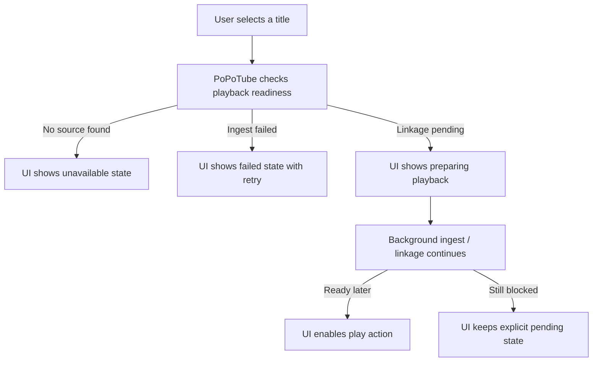

## App Flow

This section describes how the application behaves across frontend, backend, storage, and playback systems. It is not about deployment topology and not about user emotion. It is about orchestration.

### App Flow Diagram: Browse to Playback Decision

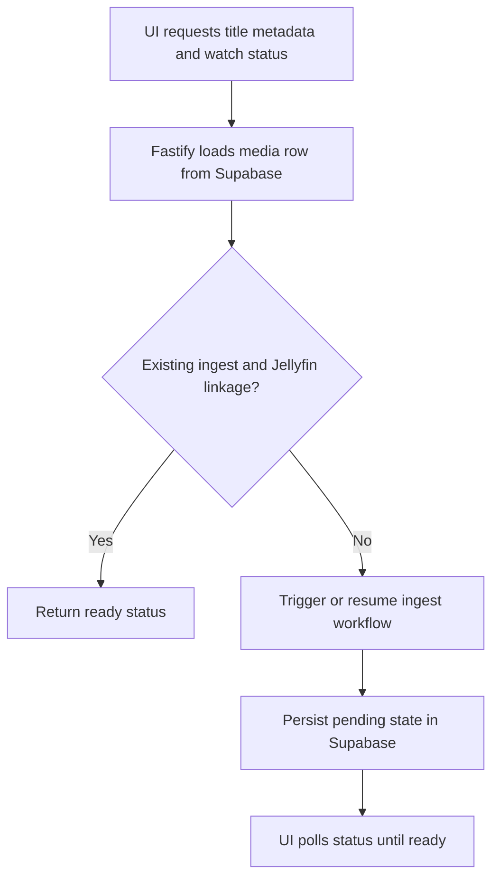

### App Flow Diagram: Ingest to Jellyfin Linkage

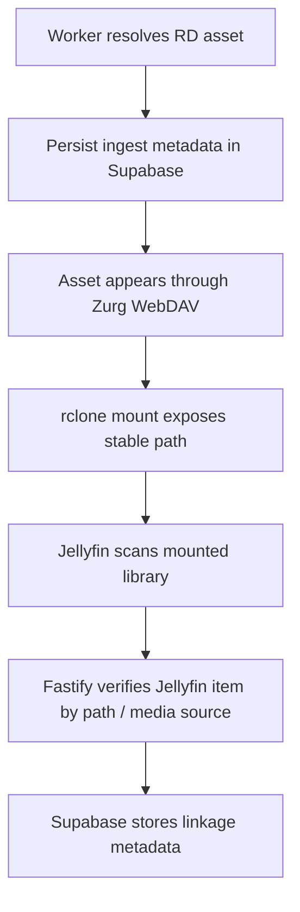

### App Flow Diagram: Playback Bootstrap

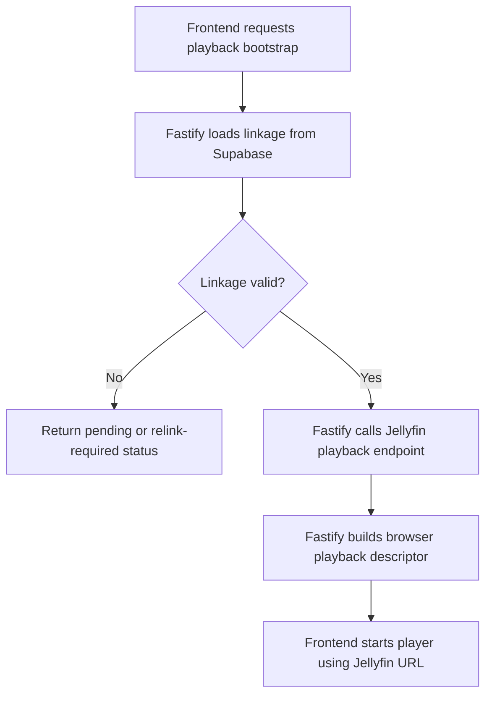

## Two Deployment Topologies

The document supports two primary runtime shapes: local development on a Mac and production or staging on a VPS.

### Local Development (Mac)

Primary assumptions:

- Next.js runs on host `http://127.0.0.1:3000`
- Fastify runs on host `http://127.0.0.1:3001`
- Jellyfin runs locally on host `http://127.0.0.1:8096`
- Zurg runs locally, either in Docker or as a local process
- rclone mounts Zurg WebDAV onto a host path, for example `/Volumes/popotube-rd` or another stable directory
- Jackett remains available as today, either through `docker-compose.dev.yml` or separately

Notes:

- `docker-compose.dev.yml` currently runs only `jackett` and `backend`, so Jellyfin, Zurg, and rclone become additional local dependencies in the new playback design.
- Fastify must be allowed to talk to Jellyfin directly on the local host.
- The browser should still talk to Fastify for bootstrap; it should not be handed raw RD URLs.

### VPS / Production

Primary assumptions:

- Next.js and Fastify are fronted by a public hostname or reverse proxy
- Jellyfin is either internal-only behind the same private network or separately exposed behind controlled auth
- Zurg runs in the same network segment as rclone and Jellyfin
- rclone mount path is persistent and stable across restarts
- Fastify can reach Jellyfin over internal networking
- CORS and token handling are controlled so browser playback never depends on exposing long-lived RD or admin Jellyfin credentials

Notes:

- Startup order matters more on the VPS than on local dev
- Jellyfin should never scan a drifting mount path that changes per deployment
- rclone mount health should be treated as a first-class dependency for playback

### Deployment Diagram: Local and VPS

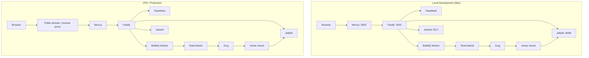

## End-to-End Data Flow

This section captures request and runtime flows. It complements the app flow diagrams but stays focused on ordered interactions between systems.

### Sequence Diagram: Discovery and Ingestion

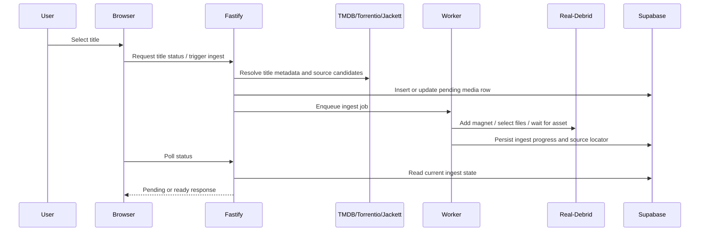

### Sequence Diagram: RD Library Exposure

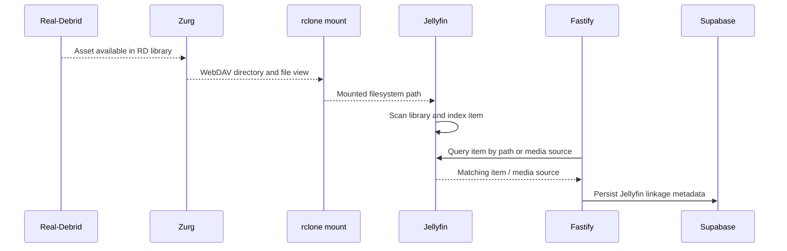

### Sequence Diagram: Playback Bootstrap

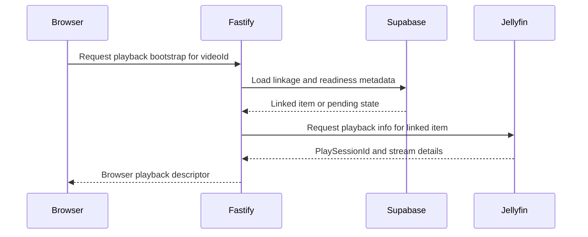

### Sequence Diagram: Playback Runtime

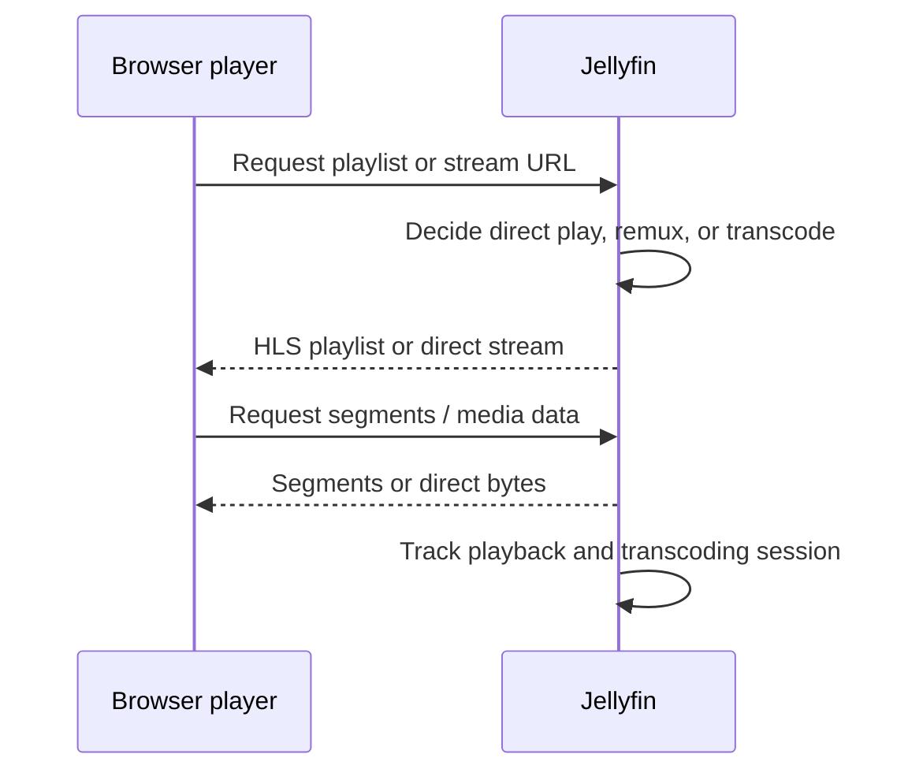

PoPoTube still chooses the title and ingest source. Jellyfin does not replace TMDB, Torrentio, Jackett, or ingest policy. It only replaces the flimsy playback tail end.

## Data Ownership and Required Metadata

The new design must have explicit data ownership instead of letting metadata drift between systems like a shopping cart in the wind.

### Ownership Model

- Supabase owns:
  - PoPoTube media identity
  - ingest lifecycle
  - user-visible playback readiness
  - linkage metadata between PoPoTube rows and Jellyfin items
- Jellyfin owns:
  - playback sessions
  - transcoding sessions
  - stream selection behavior
  - direct-play versus transcode runtime decisions
- Zurg and rclone own:
  - only the filesystem bridge
  - they are not the source of truth for media identity or user-facing status

### Required Metadata Shape

The current `videos.playback_source` or adjacent metadata should conceptually evolve to support Jellyfin linkage. The implementation can use a JSON field, expanded columns, or a related table, but the architecture should preserve these semantics:

- `provider: "jellyfin"`
- `jellyfin.server_url`
- `jellyfin.item_id`
- `jellyfin.media_source_id`
- `jellyfin.playback_mode`
- `mount.relative_path`
- `rd.source_locator`
- `link_status`
- `last_verified_at` (optional)

Recommended semantics:

- `provider`
  - identifies the playback engine, not the acquisition backend
- `jellyfin.server_url`
  - identifies the Jellyfin instance expected to serve playback
- `jellyfin.item_id`
  - persistent linked Jellyfin item for the media row
- `jellyfin.media_source_id`
  - specific media source used for playback/bootstrap validation
- `jellyfin.playback_mode`
  - last known expected mode, such as `direct`, `direct_stream`, or `transcode`
- `mount.relative_path`
  - deterministic path fragment that should exist under the rclone mount
- `rd.source_locator`
  - ingest-side locator tying the row back to the RD-backed asset
- `link_status`
  - e.g. `pending`, `linked`, `stale`, `missing`, `error`
- `last_verified_at`
  - last successful backend verification of the linkage

## Public API / Interface Changes

The frontend should stop treating a stored RD URL or a Fastify byte proxy as the playback contract.

### Current Contract

- `GET /api/stream/:videoId`
  - Fastify forwards bytes from the stored playback URL
  - useful for a temporary bridge
  - not sufficient as the long-term playback contract

### Target Contract

Introduce a Fastify-owned playback bootstrap endpoint. The exact path can be:

- `GET /api/playback/:videoId`

or

- `POST /api/playback/session`

Recommended behavior:

- frontend asks Fastify for a browser-usable playback descriptor
- Fastify validates linkage and readiness
- Fastify talks to Jellyfin
- frontend receives a playback descriptor and starts the player from that

Recommended response shape at the behavior level:

- `playbackUrl`
  - browser-usable URL for the Jellyfin playback path
- `mimeType`
  - content type or playlist type the player should expect
- `transport`
  - `hls` or `direct`
- `playSessionId`
  - Jellyfin playback session identifier
- `jellyfinItemId`
  - linked Jellyfin item id
- `isTranscoded`
  - whether the current response expects transcoded playback

Important rule:

- Browser clients must not consume raw Real-Debrid playback URLs in the target architecture.

## Linking Strategy

This is the make-or-break part. If the linkage strategy is vague, the whole architecture turns into a haunted house.

### Required Principle

PoPoTube must not rely on a full-library Jellyfin scan and then "just kind of find the right thing somehow." That is not a strategy. That is astrology with file names.

### Deterministic Linking Strategy

1. The ingest pipeline must preserve a deterministic RD-backed source locator.
2. The Zurg-exposed and rclone-mounted path must be stable and predictable.
3. Fastify must know the expected mount-relative path for the ingest result.
4. Jellyfin linkage must be validated by path and media source identity, not just title similarity.
5. Once matched, Fastify persists the linked `item_id` and `media_source_id` into Supabase.
6. Playback bootstrap uses the persisted linkage rather than repeating a best-effort library search each time.

### Link Validation Rules

Fastify should treat linkage as valid only if:

- the expected mount path exists in Jellyfin's indexed item path or media source path
- the linked item still resolves through Jellyfin
- the media source is present and playable

Fastify should mark linkage as stale or missing if:

- the mount path no longer resolves
- Jellyfin item id exists but maps to the wrong media source
- the media source disappeared after a mount or library change

## Migration Plan

This migration should be phased so the app does not detonate itself trying to switch playback mid-flight.

### Phase 1: Architecture Groundwork

Outcomes:

- define Jellyfin as the required playback engine
- add env/config surfaces for Jellyfin, Zurg, and mount configuration
- define target linkage metadata and readiness states

### Phase 2: Zurg + rclone + Jellyfin Deployment

Outcomes:

- establish Zurg WebDAV bridge
- establish stable rclone mount path
- connect Jellyfin to the mounted library
- confirm library scanning and playback behavior outside PoPoTube

### Phase 3: Fastify Jellyfin Integration

Outcomes:

- implement Jellyfin-aware playback bootstrap path
- persist deterministic linkage metadata
- implement linkage verification and stale-link handling

### Phase 4: Frontend Playback Switch

Outcomes:

- player stops depending on `GET /api/stream/:videoId`
- frontend uses the playback bootstrap descriptor
- UI clearly distinguishes ingest pending, linkage pending, ready, and failed

### Phase 5: Deprecate and Remove Legacy Byte Proxy

Outcomes:

- mark the old stream proxy as deprecated
- remove the route after Jellyfin-backed playback is fully adopted
- remove assumptions in frontend helpers that the proxy is the default playback path

## Operational Considerations

This architecture adds real playback capability, but it also adds real operational dependencies. Fancy, right.

### Startup Ordering

Preferred order:

1. Real-Debrid connectivity available
2. Zurg running and serving WebDAV
3. rclone mount healthy
4. Jellyfin able to read mounted library
5. Fastify playback bootstrap enabled

If the mount is unavailable, Jellyfin may remain up but playback linkage validation should fail fast rather than pretending everything is fine.

### Library Scan and Timing

Operational guidance:

- library scans should be predictable, not accidental
- Fastify may need a "linkage pending" state between ingest completion and Jellyfin item availability
- mounting and scanning latency should be surfaced as an explicit user-visible state rather than hidden behind indefinite polling

### Expiring RD URLs Versus Mounted Library Behavior

The target design shifts browser playback away from raw RD URLs and toward Jellyfin-managed items. That reduces direct browser dependency on expiring unrestricted links, but it does not eliminate the need to understand how Zurg exposes RD-backed content over time. The architecture therefore assumes:

- browser playback should not depend on raw unrestricted URLs
- Fastify linkage validation should detect missing or stale mounted assets
- operational monitoring should distinguish ingest success from playback-readiness success

### Observability

Important observability points:

- Fastify
  - ingest status transitions
  - playback bootstrap requests
  - linkage verification failures
  - Jellyfin API failures
- Jellyfin
  - playback session creation
  - transcode start/stop
  - stream errors
- Mount layer
  - WebDAV availability
  - rclone mount health
  - unexpected path disappearance

### Failure Handling Table

| Condition | User-facing behavior | Backend action | Log / alert expectation |
| --- | --- | --- | --- |
| No torrent candidate | Show unavailable state | Stop ingest attempt | Warning in Fastify ingest logs |
| RD ingest failed | Show failed state with retry | Mark row failed | Error in worker logs |
| Jellyfin linkage pending | Show preparing playback | Recheck linkage on status poll | Info or warn in playback bootstrap logs |
| Jellyfin linkage stale | Show retryable playback preparation state | Trigger relink or revalidation | Warning in playback logs |
| Jellyfin token or API failure | Show playback unavailable state | Fail bootstrap, keep linkage untouched until verified | Error in Fastify integration logs |
| rclone mount unavailable | Show playback unavailable or preparing state | Fail linkage validation fast | High-priority operational alert |
| Wrong Jellyfin item linked | Prevent playback start | Mark linkage stale and require relink | Warning with path mismatch details |

## Testing and Acceptance Criteria

This architecture is only useful if the future implementation can be validated without ritual sacrifice.

### Runtime Validation Scenarios

- MP4 / H264 content direct-plays through Jellyfin
- MKV or other browser-hostile sources play through Jellyfin HLS transcoding
- missing Jellyfin linkage returns a pending or retryable playback state
- Zurg or rclone mount failure produces an explicit backend failure state
- browser clients never receive raw Real-Debrid URLs in the new path
- local Mac and VPS deployment topologies are both coherent and workable

### Document Acceptance Criteria

- all Mermaid diagrams render correctly
- current and target architecture are clearly separated
- user flow, app flow, deployment flow, and runtime sequence flow each have distinct diagrams
- the implementation path is decision-complete
- the document stands on its own without requiring `future-implementation.md`
- the document is specific enough for another engineer to implement without inventing the architecture again from scratch

## References

- [Zurg GitHub](https://github.com/debridmediamanager/zurg-testing)
- [rclone mount docs](https://rclone.org/commands/rclone_mount/)
- [rclone WebDAV docs](https://rclone.org/webdav/)
- [Jellyfin codec support](https://jellyfin.org/docs/general/clients/codec-support/)
- [Jellyfin OpenAPI spec](https://api.jellyfin.org/openapi/jellyfin-openapi-stable.json)
