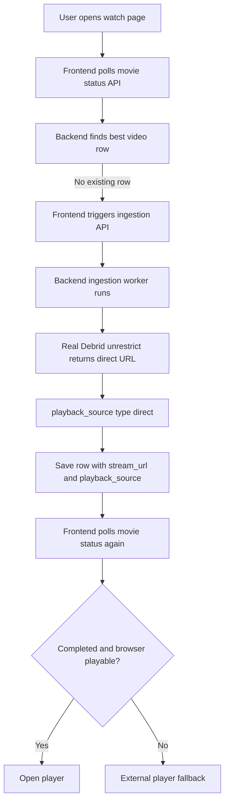

# Streaming Flow Report (Backend + Watch Playback)

This report summarizes the current PoPoTube streaming flow and pinpoints where smooth playback can degrade.

## End-to-End Flow

## Scenario Review

### 1) Browser-compatible video

- Ingestion sets `playback_source.type = direct` with `is_streamable: true` for `mp4` / `webm`.
- The watch UI uses Fastify `GET /api/stream/:videoId` (same origin as `NEXT_PUBLIC_BACKEND_URL`) so the browser talks to one egress toward Real-Debrid.

### 2) Not browser-compatible video

- Ingestion still stores `playback_source.type = direct` with `is_streamable: false` for containers like `mkv`.
- The UI treats these as not reliably playable in-browser and surfaces VLC / IINA / external options.

### 3) Which URL is saved?

- `stream_url`: canonical Real-Debrid direct URL.
- `playback_source`: JSON with type `direct`, codec/container metadata, and the same unrestricted URL.

## Why playback may still not be smooth

1. **Codec and container limits** — Browsers may fail to decode some tracks even when bytes are proxied correctly.
2. **Real-Debrid link lifetime** — If an unrestricted link expires, the row may need a refresh or re-ingest depending on Real-Debrid behavior.
3. **Network / range requests** — The stream route forwards `Range`; upstream or middleboxes can still cause stalls.
