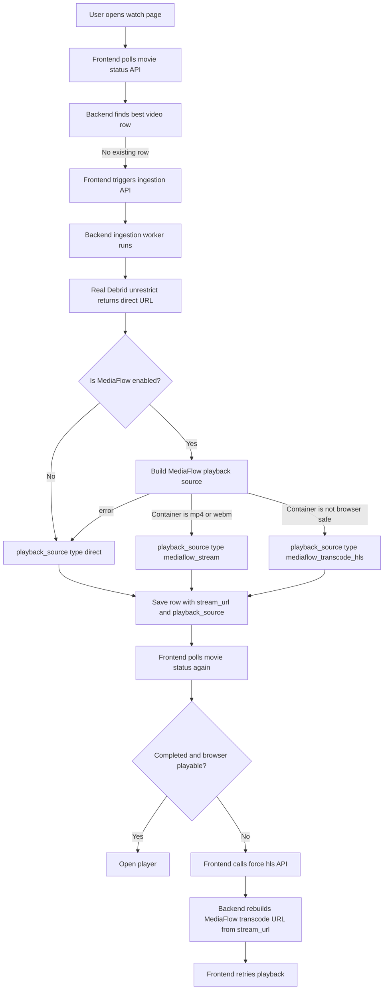

# Streaming Flow Report (Backend + Watch Playback)

This report summarizes the current PoPoTube streaming flow and pinpoints where smooth playback can degrade.

## End-to-End Flow

---

## Scenario Review

### 1) Browser-compatible video

- In ingestion, file extension is checked.
- If browser-safe (`mp4`, `webm`) and MediaFlow build succeeds:
  - `playback_source.type = mediaflow_stream`
- If MediaFlow build fails:
  - fallback to `playback_source.type = direct` (Real-Debrid URL)

### 2) Not browser-compatible video

- For non-browser-safe containers (for example `mkv`):
  - preferred: `playback_source.type = mediaflow_transcode_hls`
- If it ends up non-playable at client:
  - frontend calls `POST /api/public/force-hls`
  - backend rebuilds HLS playback source using saved `stream_url`

### 3) Which URL is saved as source playback?

- `stream_url` (DB):
  - canonical Real-Debrid direct URL (source-of-truth)
- `playback_source` (DB):
  - selected runtime playback path (`direct` / `mediaflow_stream` / `mediaflow_transcode_hls`)

### 4) User exits during MediaFlow playback and returns later

- MediaFlow tokenized URLs are short-lived.
- If old token URL is reused, playback can fail.
- Current improvement: `movie-status` now regenerates fresh MediaFlow URL from `stream_url` for MediaFlow source types before returning response.

---

## Why playback may still not be smooth

1. **Short-lived URLs**
   - MediaFlow token URL expires over time (mitigated by regeneration in `movie-status`).

2. **Real-Debrid URL expiry**
   - Even with fresh MediaFlow token, upstream `stream_url` may itself be expired.
   - This is now the main long-tail reliability risk for return-later playback.

3. **Codec/container browser limits**
   - Some HLS/audio combinations can decode poorly in Chromium.
   - Frontend already attempts fallback to force-HLS and shows user-facing hints.

4. **Extra network hops**
   - Proxy/transcode path can add startup latency and buffering sensitivity under load.

---

## Current Status Summary

- Backend ↔ MediaFlow health can be fully healthy while playback still fails if:
  - saved `stream_url` is expired, or
  - client receives stale/failed playback source path.
- The new `movie-status` refresh step addresses stale MediaFlow token URLs.

---

## Recommended Next Reliability Step

Implement automatic refresh of expired Real-Debrid `stream_url` before (or when) regenerating MediaFlow playback source, so "come back tomorrow and play" works consistently.
