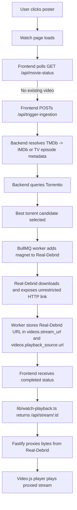
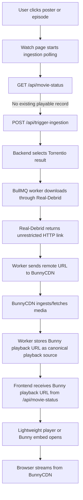
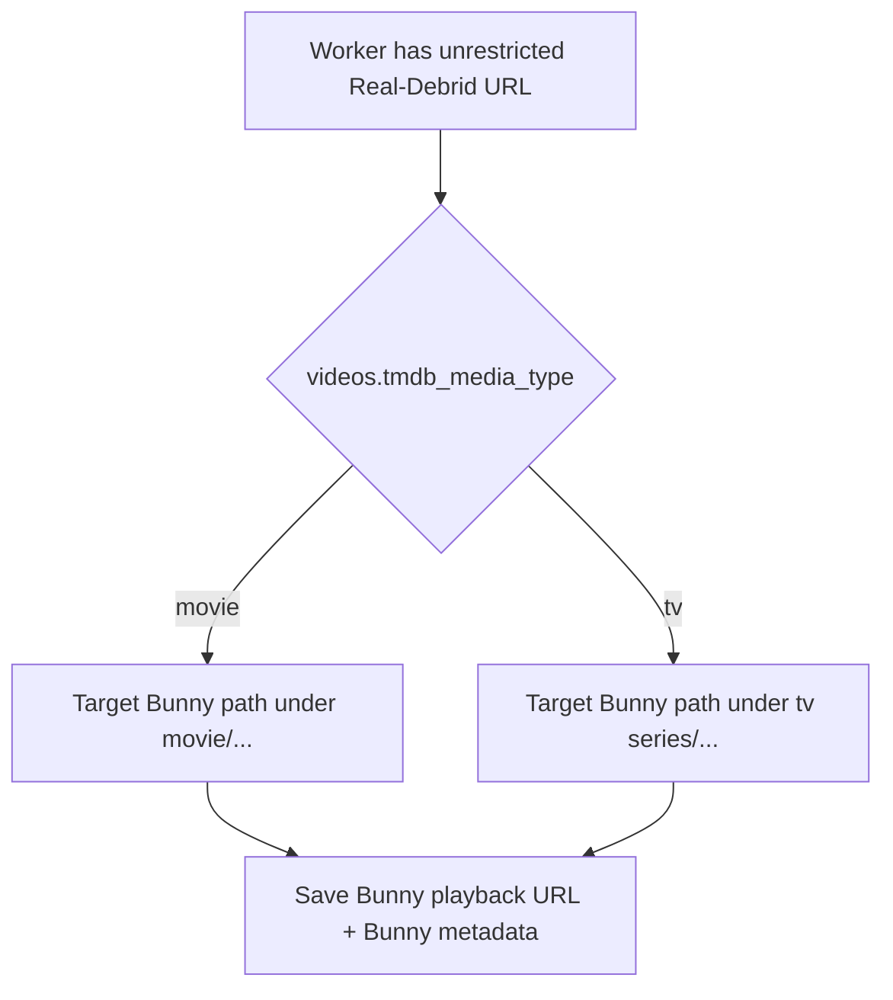
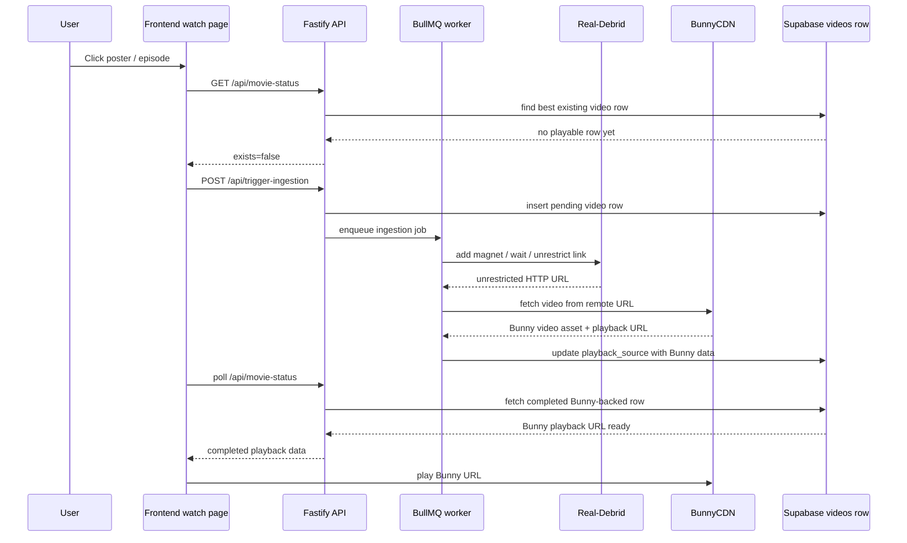

# BunnyCDN playback implementation plan

## Objective

Replace the current in-app Video.js playback flow with a BunnyCDN-based playback flow.

The application already works today with this rough path:

1. User clicks a poster.
2. The frontend triggers backend ingestion.
3. The backend searches Torrentio.
4. Real-Debrid downloads the selected torrent and exposes an unrestricted HTTP link.
5. The app currently stores that Real-Debrid URL and plays it through the existing watch flow.

The new goal is different:

- Once Real-Debrid exposes the unrestricted HTTP link, the backend must send that source URL to BunnyCDN.
- BunnyCDN will fetch the media from the unrestricted Real-Debrid URL.
- The app should then use the BunnyCDN playback URL as the final streaming URL.
- The existing Video.js player should be removed.

This is the main point, because the current setup is doing extra gymnastics like it is trying out for the Olympics.

## Important business rules

Use these exact BunnyCDN folders:

1. Movies must go into the `movie` folder.
2. TV series must go into the `tv series` folder.

Media routing must follow these rules:

- If the selected title is a movie, BunnyCDN pathing must target `movie/...`
- If the selected title is a TV episode, BunnyCDN pathing must target `tv series/...`

The folder name `tv series` should stay exactly as written because that is how it was created in the BunnyCDN dashboard. If any Bunny API or URL builder requires encoding, encode the space correctly, but do not silently rename the folder.

## Current code behavior to replace

The current watch flow is built around storing a Real-Debrid playback URL and then playing it through the app:

- `hooks/useWatchIngestion.ts`
- `components/public/watch/WatchPageShell.tsx`
- `components/public/watch/WatchNetflixPlayer.tsx`
- `lib/watch-playback.ts`
- `backend/src/routes/stream.ts`
- `backend/src/queue/ingestion.ts`
- `backend/src/lib/playback-source.ts`

Today, `backend/src/queue/ingestion.ts` does the critical Real-Debrid work:

1. Add magnet to Real-Debrid.
2. Wait for conversion and download completion.
3. Call `unrestrictLink(...)`.
4. Store the unrestricted Real-Debrid `download` URL in `stream_url` and `playback_source.url`.

That is the insertion point for BunnyCDN.

## Codebase-specific findings

This section is based on the current repository structure, not wishful thinking.

### Movie watch path

- `app/(public)/watch/[tmdb_id]/page.tsx` renders the movie watch experience.
- `components/public/watch/WatchPageShell.tsx` drives the movie watch flow.
- `hooks/useWatchIngestion.ts` polls `GET /api/movie-status` and, when nothing exists yet, posts to `POST /api/trigger-ingestion`.
- Once playback is ready, `WatchPageShell.tsx` opens `components/public/watch/WatchNetflixPlayer.tsx`.
- `WatchNetflixPlayer.tsx` is the current fullscreen Video.js player.

### TV watch path

- `app/(public)/watch/tv/[tmdb_id]/page.tsx` renders the TV watch experience.
- `components/public/watch/WatchTvSeriesExperience.tsx` drives episode selection and playback.
- `hooks/useTvEpisodeIngestion.ts` posts to `POST /api/trigger-ingestion` with:
  - `media_type: "tv"`
  - `season_number`
  - `episode_number`
- TV status checks still go through `GET /api/movie-status`, but with `season` and `episode` query params.

### Current playback URL behavior

- `lib/watch-playback.ts` currently converts any completed playback row into a frontend playback URL.
- If the row has `status.id` and a `playback_source.url`, it returns `GET /api/stream/:id`.
- `backend/src/routes/stream.ts` then proxies bytes from the stored upstream URL.
- `backend/src/lib/playback-public.ts` normalizes public playback data and currently forces `source_type: "real_debrid"`.

### Current worker behavior

- `backend/src/queue/ingestion.ts` is where the real playback URL is finalized today.
- After `rdClient.unrestrictLink(...)`, the worker stores:
  - `stream_url = unrestrictData.download`
  - `playback_source.url = unrestrictData.download`
  - `playback_source.source_type = "real_debrid"`

That means BunnyCDN cannot be bolted on only in the frontend. The backend worker is the real decision point.

## Current flow diagram



## New target workflow

The new workflow should be:

1. User clicks a poster on the frontend.
2. The frontend still calls the backend trigger as it does today.
3. The backend resolves metadata and searches Torrentio.
4. The backend selects the best candidate.
5. Real-Debrid downloads the torrent and returns an unrestricted HTTP link.
6. The backend sends that unrestricted HTTP link to BunnyCDN.
7. BunnyCDN ingests or fetches the file from that link.
8. The backend receives or constructs the BunnyCDN playback URL.
9. The backend stores the BunnyCDN playback URL as the canonical playback source.
10. The frontend plays the BunnyCDN URL instead of the Real-Debrid URL.

In plain English: Real-Debrid becomes the upstream source, BunnyCDN becomes the delivery layer, and the browser should stream from BunnyCDN, not directly from Real-Debrid.

## Target flow diagram



## Movie vs TV routing diagram



## Required frontend change

Remove the existing Video.js-based player.

### What to remove

- Remove the `video.js` dependency from the frontend package.
- Remove `@types/video.js`.
- Remove `components/public/watch/WatchNetflixPlayer.tsx`.
- Remove the Video.js CSS loading and any Video.js-specific styling that only exists for that player.
- Remove any helper code that exists only to pick Video.js MIME types.

### What to replace it with

Use a simpler playback component that accepts a BunnyCDN playback URL.

Preferred approach:

- Replace the fullscreen Video.js modal with a lightweight native HTML5 `<video>` player or a Bunny-compatible embedded player.
- The new player should receive the final Bunny playback URL from the existing watch flow.
- The frontend should no longer depend on Video.js behavior, Video.js MIME guessing, or the Fastify byte proxy as the primary playback path.

The key requirement is not the exact player widget. The key requirement is that the player consumes BunnyCDN as the playback source.

## Required backend change

The ingestion worker must stop treating the unrestricted Real-Debrid URL as the final browser playback URL.

Instead, after this step:

```ts
const unrestrictData = await rdClient.unrestrictLink(torrentInfo.links[0]);
const fullDownloadUrl = unrestrictData.download;
```

the worker should:

1. Determine whether the item is a movie or TV episode.
2. Build the BunnyCDN target path under the correct folder.
3. Send the unrestricted Real-Debrid URL to BunnyCDN so Bunny fetches the file.
4. Wait for or resolve the Bunny playback URL.
5. Save the Bunny playback URL into the video record as the final playback source.

## Backend integration direction

The backend should add a Bunny integration module and call it from the ingestion worker immediately after Real-Debrid returns the unrestricted URL.

Suggested structure:

- `backend/src/lib/bunny.ts`
- `backend/src/lib/bunny-path.ts`

Suggested responsibilities:

- `buildBunnyTargetPath(videoRow)`:
  - choose `movie/...` vs `tv series/...`
  - build deterministic folder and filename paths
- `fetchVideoIntoBunny(...)`:
  - call Bunny with the unrestricted Real-Debrid URL
  - pass collection or path metadata if the chosen Bunny product supports it
- `resolveBunnyPlaybackUrl(...)`:
  - return the public URL used by the frontend

### Codebase-specific caution

If the worker keeps the Real-Debrid URL in `stream_url`, the current public playback normalization code will keep preferring that URL.

Specifically:

- `backend/src/lib/playback-public.ts` prefers `stream_url` first
- `lib/watch-playback.ts` converts any stored playback row into `/api/stream/:id`

So the implementation must do one of these on purpose:

1. Stop storing the Real-Debrid URL in `stream_url`, and store Bunny as the canonical playback URL.
2. Or change the normalization logic so Bunny is explicitly preferred over the Real-Debrid upstream URL.

Do not leave this ambiguous, because the app will happily keep serving the old path while pretending it moved on.

## BunnyCDN folder routing

Use this routing policy:

### Movie

- Root folder: `movie`
- Suggested path pattern:
  - `movie/{tmdb_id}/{sanitized-title}-{year}.{ext}`

### TV series

- Root folder: `tv series`
- Suggested path pattern:
  - `tv series/{tmdb_id}/season-{season_number}/episode-{episode_number}/{sanitized-title}.{ext}`

The exact filename format can be adjusted, but the root folder rule must stay:

- movies => `movie`
- tv episodes => `tv series`

## BunnyCDN documentation notes

Use official Bunny documentation, not blog-post astrology.

Relevant official documentation discovered for this implementation:

- Stream API reference: [https://docs.bunny.net/api-reference/stream](https://docs.bunny.net/api-reference/stream)
- Fetch video from URL: [https://docs.bunny.net/api-reference/stream/manage-videos/fetch-video](https://docs.bunny.net/api-reference/stream/manage-videos/fetch-video)
- Create collection: [https://docs.bunny.net/api-reference/stream/manage-collections/create-collection](https://docs.bunny.net/api-reference/stream/manage-collections/create-collection)
- Embed videos: [https://docs.bunny.net/stream/embedding](https://docs.bunny.net/stream/embedding)

Important documented details:

- Bunny Stream uses `https://video.bunnycdn.com` as the API base URL.
- The API authenticates with the `AccessKey` header.
- Bunny supports fetching a video from a remote URL, which matches the need to hand it the unrestricted Real-Debrid link.
- Bunny supports collections. If the product setup maps better to collections than literal nested paths, that can be used as the implementation detail, but the business meaning must still map to:
  - `movie`
  - `tv series`

If the chosen Bunny product is Bunny Stream rather than Storage/Pull Zone, the "folders" created in the dashboard may actually need to be represented as collections or naming conventions rather than filesystem-style directories. The implementing AI must confirm that against the actual account setup before hardcoding the wrong abstraction like a menace.

## Persistence rules

After BunnyCDN accepts the upstream URL, store Bunny as the canonical playback source.

Do not keep the frontend pointed at the unrestricted Real-Debrid URL as the main playback target.

Recommended behavior:

- `playback_source.url` should become the BunnyCDN playback URL.
- `playback_source.source_type` should identify BunnyCDN, not Real-Debrid.
- If needed, keep the unrestricted Real-Debrid URL in a separate internal field for operational use, but not as the public playback URL.

This matters because the whole point of the change is to stream through BunnyCDN.

## Database schema assessment

### What exists today

From the current migrations and code:

- `videos.stream_url` exists and is currently used as a canonical upstream URL.
- `videos.playback_source` exists and stores playback metadata as JSON.
- `videos.tmdb_media_type` exists and already distinguishes `movie` vs `tv`.
- `videos.season_number` and `videos.episode_number` exist for TV episode identity.
- `videos.movie_id` and `videos.tv_episode_id` exist as optional normalized identity links.

That means the repo already has enough data to decide:

- whether a record is a movie or TV episode
- which Bunny root folder to use
- which season/episode path to generate for TV

### Does the database need a migration?

Minimum answer:

- A schema migration is not strictly required for a first BunnyCDN implementation if the app reuses `playback_source` JSON and stores Bunny metadata there.

However, there is an important catch:

- The current code assumes `playback_source.source_type = "real_debrid"`.
- The current public playback helpers prefer `stream_url`.
- The current TypeScript type for `PlaybackSource` only allows `source_type: "real_debrid"`.

So while Postgres may not require a migration, the application contract absolutely requires updates.

### Recommended schema strategy

#### Option A: minimum-change path

No immediate DB migration.

Do this instead:

- Store Bunny playback URL in `playback_source.url`
- Store Bunny metadata in `playback_source`
- Expand app types to allow `source_type: "bunnycdn"`
- Stop using `stream_url` as the canonical public playback field for this flow

This is the fastest path.

#### Option B: cleaner long-term path

Add explicit Bunny and upstream fields, for example:

- `videos.bunny_playback_url`
- `videos.bunny_video_id`
- `videos.bunny_collection`
- `videos.upstream_source_url`

This is cleaner operationally, but it is not required if the team wants the smallest possible first change.

### Recommendation

Use Option A first unless there is a strong operational need to keep the unrestricted Real-Debrid URL separately queryable in SQL.

If the team does want to preserve both URLs without ambiguity, then add a migration. Otherwise `playback_source` JSON is already flexible enough.

## Playback source model changes

The current playback source type is too Real-Debrid-specific:

```ts
export type PlaybackSource = {
  type: "direct" | "proxy";
  url: string;
  codec: string;
  container: string;
  mime_type: string;
  is_streamable: boolean;
  source_type: "real_debrid";
};
```

This should be expanded so BunnyCDN is represented explicitly.

Recommended direction:

- Add a Bunny-aware `source_type`, such as `"bunnycdn"`.
- Allow `type` to represent Bunny delivery if needed, or keep `type: "direct"` and rely on `source_type`.
- If useful, add metadata such as:
  - Bunny asset path
  - Bunny library or zone identifier
  - Bunny collection name or id
  - Bunny public playback URL
  - Bunny status

The schema does not have to match these names exactly, but the app should stop pretending every playable URL is a Real-Debrid URL. That trick has had a good run.

## API and orchestration expectations

The implementation should introduce a dedicated BunnyCDN integration layer, for example:

- `backend/src/lib/bunny.ts`

That module should handle:

- building the Bunny target path
- choosing the correct top-level folder
- sending the unrestricted Real-Debrid URL to BunnyCDN
- returning the final Bunny playback URL

Recommended environment variables:

- `BUNNY_API_KEY`
- `BUNNY_LIBRARY_ID` or the equivalent identifier required by the chosen Bunny product
- `BUNNY_PULL_ZONE` or the equivalent public delivery base URL
- `BUNNY_MOVIE_COLLECTION` or equivalent mapping for `movie`
- `BUNNY_TV_COLLECTION` or equivalent mapping for `tv series`
- optional folder or base path configuration if needed

## Watch flow expectations

The public watch pages should continue to feel the same from the user's point of view:

1. Click poster.
2. Wait while the title is being prepared.
3. Play once ready.

But internally the readiness condition changes:

- "ready" should mean BunnyCDN playback URL is available
- not merely "Real-Debrid unrestricted URL exists"

## What should no longer be the primary path

Avoid keeping this as the main browser playback strategy:

- browser -> frontend -> Fastify `/api/stream/:id` -> Real-Debrid unrestricted URL

That is the current logic. The new primary strategy should be:

- browser -> BunnyCDN playback URL

If a temporary fallback is needed during rollout, it can exist behind a feature flag, but BunnyCDN must be the intended default path.

## Implementation sequence diagram



## Suggested implementation steps

1. Add BunnyCDN config and a backend integration module.
2. Update the ingestion worker so BunnyCDN processing happens immediately after `unrestrictLink(...)`.
3. Route movies into `movie/...`.
4. Route TV episodes into `tv series/...`.
5. Save BunnyCDN playback data into the `videos` row.
6. Update `movie-status` responses so the frontend receives the Bunny playback URL.
7. Simplify `lib/watch-playback.ts` around Bunny playback instead of Video.js proxy logic.
8. Remove `WatchNetflixPlayer.tsx`.
9. Remove `video.js` dependencies and related CSS/type glue.
10. Replace the player UI with a simple Bunny-ready playback component.

## Acceptance criteria

The implementation is complete when all of the following are true:

- Clicking a movie poster eventually produces a BunnyCDN playback URL.
- Clicking a TV episode eventually produces a BunnyCDN playback URL.
- Movies are stored under the Bunny `movie` folder.
- TV episodes are stored under the Bunny `tv series` folder.
- The frontend plays from BunnyCDN.
- The existing Video.js dependency is removed.
- The old Fastify stream proxy is no longer the primary playback path.

## Assumptions for the implementing AI

Assume the following unless project code or environment proves otherwise:

- The unrestricted Real-Debrid URL is valid long enough for BunnyCDN to fetch the media.
- BunnyCDN has an API flow that can ingest or fetch media from a remote HTTP URL.
- The app should preserve the current user experience, but replace the delivery layer under the hood.
- TV content already carries enough metadata in the existing ingestion flow to decide that it belongs under `tv series`.
- The current session does not expose a database MCP server, so schema direction here is derived from the checked-in Supabase migrations and application code.

## One important note

`AGENTS.md` currently says BunnyCDN was removed from the architecture. That statement should be treated as outdated for this implementation, because the new goal is to restore BunnyCDN as the playback delivery layer.
